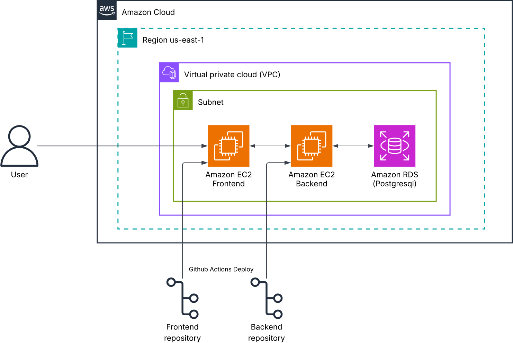

# **Employee Reimursement System — Technical Documentation**

## **Tech Stack**

### **1. Frontend**

| Component | Technology Used | Stable Version | Description |
|------------|------------------|----------------|--------------|
| **Markup & Styling** | HTML5, CSS3 | Latest | Used to create a responsive and accessible user interface. |
| **Scripting** | JavaScript (Vanilla JS) | ES6+ | Handles API integration, form validation, and user interactions. |
| **Design Framework** | Bootstrap (optional) | 5.x | Optional use for layout, grid, and responsive design. |
| **PWA Support** | Web App Manifest, Service Worker | — | Enables offline functionality and mobile compatibility. |

### **2. Backend**

| Component | Technology Used | Stable Version | Description |
|------------|------------------|----------------|--------------|
| **Framework** | Django REST Framework (DRF) | 3.16 | Handles APIs, authentication, and business logic. |
| **Language** | Python | 3.13.7 | Backend development language for logic and integration. |
| **Authentication** | Simple JWT (DRF) | 5.5.1| Provides stateless user authentication via JWT tokens. |
| **Database** | PostgreSQL | 16 | Stores structured data with relational integrity. |
| **ORM** | Django ORM | Included | Simplifies database queries and migrations. |

### **3. Tools & Infrastructure**

| Component | Technology Used | Stable Version | Description |
|------------|------------------|----------------|--------------|
| **Version Control** | Git + GitHub | Latest | Used for source code management and collaboration. |
| **CI/CD Pipeline** | GitHub Actions | Latest | Automates build, testing, and deployment workflows. |
| **Package Management** | pip | 25.2 | Handles dependency installation and environment management. |
| **IDE / Code Editor** | VS Code | Latest | Development environment for writing and debugging code. |


## **Data Modeling**
The Employee Reimursement System (ERS) uses a structured relational schema built on PostgreSQL to ensure data integrity, consistency, and relational linkage between entities.
### **Why Structured Database**
- Financial and transactional data require accuracy, consistency, and referential integrity.
- PostgreSQL enforces ACID compliance, foreign keys, and data constraints, critical for reimbursement and audit workflows.
- Complex queries (filtering requests, aggregating expenses, generating reports) are efficiently handled using SQL joins.
### **Schema Diagram**
{ width="50%" style="display:block; margin-left:auto; margin-right:auto;" }
### **Entity Descriptions**
**1. User:** Represents both employees and admins. Each user has unique credentials and a defined role that controls access within the system. The emp_id field allows mapping users to internal company records.

**2. Request:** Stores details of each reimbursement request. Every request is linked to one user and can include multiple expense entries. Requests move through different statuses — draft, submitted, approved, or rejected — based on workflow actions.

**3. Expenses:** Contains detailed records of individual expenses under a request. Each expense entry includes its title, category, description, amount.

## **Architectural Overview**
The system is composed of three primary layers:

**1. Frontend:** A lightweight web interface built with HTML, CSS, and JavaScript. Communicates with the backend via REST APIs. Implements form handling, JWT-based session management, and responsive design.

**2. Backend:** Developed using Django REST Framework (DRF). Handles authentication, authorization, business logic, and CRUD operations for all entities (Users, Requests, Expenses).

**3. Database:** PostgreSQL serves as the structured data store ensuring relational integrity, transactional safety, and auditability.

### **Architecture Diagram**
{ width="100%" style="display:block; margin-left:auto; margin-right:auto;" }

## **Data Flow**
The Employee Reimursement System (ERS) follows a centralized, role-driven data flow connecting the frontend, backend, and database layers.
All interactions occur through authenticated REST API endpoints secured with JWT tokens.
### **Overview**
The system consists of two user types — Employee and Admin — both interacting with the same backend and database through different process flows:

- **Employee:** creates, edits, and submits reimbursement requests along with related expenses.
- **Admin:** reviews submitted requests, checks expense details, and approves or rejects them.
- **Database:** stores all user, request, and expense data while maintaining referential integrity.
### **Data Flow Diagram**
{ width="100%" style="display:block; margin-left:auto; margin-right:auto;" }


### **Flow Description**
#### Authentication (JWT)
- Both Employee and Admin log in with credentials.
- The backend validates users against the users table.
- If valid, it generates a JWT token (Access + Refresh).
- All further requests include this token for secure authorization.
#### Employee Operations
- Employee creates or edits a reimbursement request (stored in requests table) while its status is Draft.
- Employee can add, view, or modify expenses under that request (stored in expenses table).
- When ready, the employee submits the request, changing its status to Submitted in the database.
- Once submitted, the employee can only view the request and related expenses — editing is disabled.
#### Admin Operations
- Admin views all submitted requests.
- Admin opens a request to view associated expenses.
- Admin verifies the claim and updates its status to either Approved or Rejected.
- This status update is reflected in the requests table and visible to the employee.
### **Data Flow Summary**

| Step | Actor            | Process                        | Database Interaction                   |
| ---- | ---------------- | ------------------------------ | -------------------------------------- |
| 1    | Employee / Admin | Login & Authentication         | Validate user and issue JWT token      |
| 2    | Employee         | Create / Edit / Delete Request | Insert or update record in `requests`  |
| 3    | Employee         | Add / Edit / View Expenses     | Insert or update record in `expenses`  |
| 4    | Employee         | Submit Request                 | Update `requests.status = 'submitted'` |
| 5    | Admin            | View Submitted Requests        | Query `requests.status = 'submitted'`  |
| 6    | Admin            | View Expenses                  | Query linked `expenses` for a request  |
| 7    | Admin            | Approve / Reject Request       | Update `requests.status` accordingly   |


## **Authentication**
The Employee Reimursement System (ERS) uses JWT (JSON Web Token)–based authentication implemented through Django REST Framework Simple JWT.  
This ensures stateless, secure communication between the frontend and backend, with short-lived access tokens and refresh tokens for session continuity.
### **Authentication Process Overview**

1. The user (either Employee or Admin) enters their username and password in the login form.  
2. The frontend sends these credentials to the backend authentication endpoint (`/api/auth/login/`).  
3. The backend validates the credentials against the `users` table.  
4. If valid, the backend generates both an Access Token and a Refresh Token using Simple JWT.  
5. These tokens are returned to the frontend, which stores them securely (typically in `localStorage`).  
6. For subsequent API requests, the frontend includes the `Authorization: Bearer <access_token>` header.  
7. If the access token expires, the frontend uses the refresh token to obtain a new one.  
8. If credentials are invalid, the backend returns an appropriate error message (HTTP 401 Unauthorized).

### **Token Configuration (Example)**

```python
SIMPLE_JWT = {
    "ACCESS_TOKEN_LIFETIME": timedelta(minutes=5),
    "REFRESH_TOKEN_LIFETIME": timedelta(hours=1),
    "ROTATE_REFRESH_TOKENS": False,
    "BLACKLIST_AFTER_ROTATION": True,
    "UPDATE_LAST_LOGIN": True,
}
```

## **Authorization**
After authentication, the Employee Reimursement System (ERS) enforces role-based authorization to control access to system resources.  
Every authenticated user is assigned a role (`admin` or `employee`), which defines their permissions and scope of operations within the application.

### **Authorization Overview**

#### Authorization ensures that:

- Employees can only access and manage their own reimbursement data.  
- Admins can view and manage all reimbursement requests except those still in draft status.  
- Only Admins can add new users to the system.  

### **Roles and Access Levels**

| Role | Description | Access Scope |
|------|--------------|---------------|
| **Admin** | Administrative user with elevated privileges for user and request management. | Can view all requests that are not in draft status (submitted, approved, rejected) and can add new users. |
| **Employee** | Regular user who creates and manages their own reimbursement requests and expenses. | Can view all their requests, add expenses, edit draft requests, and submit requests for approval. |


### **Permissions Matrix**

| Action | Employee | Admin |
|--------|-----------|-------|
| Add new user | No | Yes |
| View users | No | Yes |
| Create reimbursement request | Yes | No |
| Edit draft request | Yes (own only) | No |
| Submit request | Yes (own only) | No |
| View requests | Yes (all own requests) | Yes (all except drafts) |
| Approve / reject request | No | Yes |
| Add expenses to a request | Yes (own, while draft) | No |
| Edit / delete expenses | Yes (own, while draft) | No |
| View expenses | Yes (own) | Yes (all linked to viewable requests) |


### **Implementation in Django REST Framework**

Authorization is implemented through **custom permission classes** combined with JWT authentication.

#### **Default Authentication and Permissions**
```python
REST_FRAMEWORK = {
    'DEFAULT_AUTHENTICATION_CLASSES': (
        'rest_framework_simplejwt.authentication.JWTAuthentication',
    ),
    'DEFAULT_PERMISSION_CLASSES': (
        'rest_framework.permissions.IsAuthenticated',
    ),
}
```

### **Security and Access Control Summary**
- **Role-based access control (RBAC):** Clearly separates administrative privileges from employee actions.
- **Backend-enforced permissions:** Prevent unauthorized access regardless of client behavior.
- **Data isolation:** Employees cannot view or modify other users’ data.
- **JWT token validation:** Ensures all API interactions are authenticated and role-checked before execution.